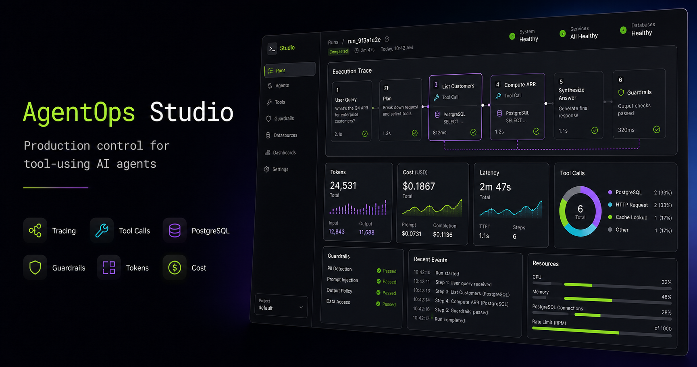
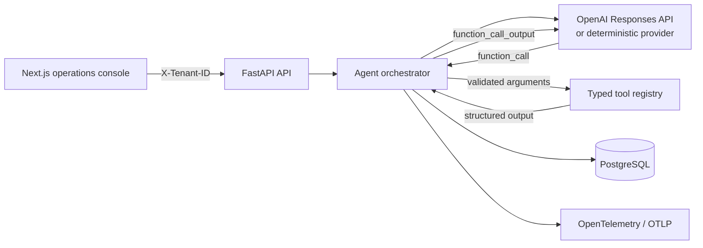

# AgentOps Studio

**A production-minded control plane for multi-step, tool-using AI agents.** AgentOps Studio shows how to build the part that sits between an LLM demo and a dependable SaaS feature: orchestration, strict tool contracts, tenant isolation, cost accounting, loop guards, traces, and an operator-friendly UI.



## Why this project exists

Tool calling is easy to demo and surprisingly easy to implement incorrectly. A reliable flow must return every tool result to the same model context, let the model request additional tools, persist enough state to reconstruct the run, and stop safely when execution becomes expensive or repetitive.

AgentOps Studio demonstrates that complete path:

- sequential OpenAI Responses API tool calls with `function_call_output` correlation;
- strict JSON Schema contracts and typed tool failures;
- conversation, message, run, and per-step persistence;
- PostgreSQL tenant boundaries and usage aggregation;
- input/output/cached-token accounting and configurable model pricing;
- maximum-step, repeated-call, timeout, schema, and budget guards;
- structured JSON logs plus optional OpenTelemetry export;
- a polished operations dashboard with a real FastAPI mode and zero-key demo mode;
- Docker Compose, Alembic migrations, tests, and CI.

## Product tour

- **Operations overview** — cost, token volume, reliability SLOs, tool traffic, and recent runs.
- **Agent playground** — execute a real multi-tool investigation and inspect the reconstructed trace.
- **Run explorer** — review successful, guarded, and failed requests with model and tool timing.
- **Tool registry** — inspect strict schemas and operational metadata.
- **Guardrails** — make the agent's autonomy envelope explicit and auditable.

## Architecture



The repository defaults to a deterministic provider, so the full seven-step run works without credentials. Set `AGENT_PROVIDER=openai` and provide `OPENAI_API_KEY` to use the production provider adapter.

## Quick start

### Docker Compose

```bash
cp .env.example .env
docker compose up --build
```

Open:

- dashboard: <http://localhost:3000>
- API docs: <http://localhost:8000/docs>
- health: <http://localhost:8000/health>

### Local development

```bash
# Backend
python3 -m venv .venv
.venv/bin/pip install -e 'backend[dev]'
.venv/bin/uvicorn agentops.main:app --app-dir backend --reload

# Frontend, in another terminal
npm ci
NEXT_PUBLIC_API_URL=http://localhost:8000 npm run dev
```

SQLite is the local fallback when `DATABASE_URL` is omitted. Docker Compose uses PostgreSQL and runs the Alembic migration before booting the API.

## Try the agent API

```bash
CONVERSATION_ID=$(curl -s -X POST http://localhost:8000/api/v1/conversations \
  -H 'Content-Type: application/json' \
  -H 'X-Tenant-ID: tenant_northstar' \
  -d '{"title":"Revenue risk review"}' | jq -r .id)

curl -s -X POST \
  "http://localhost:8000/api/v1/conversations/$CONVERSATION_ID/messages" \
  -H 'Content-Type: application/json' \
  -H 'X-Tenant-ID: tenant_northstar' \
  -d '{"content":"Review revenue risk and identify the customers needing attention."}' | jq
```

The deterministic provider performs this dependency chain:

```text
model → get_revenue_summary → model → search_orders
      → model → get_customer_health → final grounded answer
```

## Reliability envelope

| Boundary | Default | Behavior |
| --- | ---: | --- |
| Model turns | 8 | Marks the run `guarded` at the limit |
| Repeated tool signature | 2 | Stops identical tool/argument loops |
| Tool timeout | 5 s | Classifies timeout and retries once |
| Run deadline | 30 s | Ends the entire orchestration safely |
| Estimated spend | $0.25/run | Stops before unbounded model cost |
| Tool arguments | strict | Rejects missing and unknown fields |

## API surface

| Method | Path | Purpose |
| --- | --- | --- |
| `GET` | `/health` | Database-backed readiness check |
| `GET` | `/api/v1/tenants` | Demo tenant directory |
| `POST` | `/api/v1/conversations` | Create tenant-scoped state |
| `POST` | `/api/v1/conversations/{id}/messages` | Execute the agent loop |
| `GET` | `/api/v1/runs` | List recent traces |
| `GET` | `/api/v1/runs/{id}` | Reconstruct one run |
| `GET` | `/api/v1/tools` | Inspect strict tool schemas |
| `GET` | `/api/v1/metrics/summary` | Aggregate tenant usage and cost |

## Verification

```bash
npm run lint
npm test
.venv/bin/ruff check backend
.venv/bin/pytest backend/tests -q --cov --cov-fail-under=80
```

The backend suite covers the real multi-step loop, repeated-call guard, strict schema rejection, tenant isolation, persistence, API flow, and usage accounting.

## Design decisions

- **Manual loop, thin provider adapter.** The orchestration is intentionally visible rather than hidden behind a framework, making state transitions and failure behavior easy to audit.
- **Provider-neutral core.** `MockProvider` and `OpenAIProvider` share a small interface; tests never need a network call.
- **Tool errors return to the model.** Validated failures become structured tool outputs, allowing the model to recover when possible while preserving the trace.
- **No secret required for the portfolio demo.** The UI remains interactive when the API is absent, while the same screen uses the live backend when `NEXT_PUBLIC_API_URL` is configured.
- **Pricing is explicit configuration.** Defaults are versioned in code and should be reviewed when providers change pricing.

See [architecture details](docs/architecture.md), the [tool-loop walkthrough](docs/tool-loop.md), and the [operations runbook](docs/runbook.md).

## Official implementation references

- [OpenAI function calling guide](https://developers.openai.com/api/docs/guides/function-calling)
- [OpenAI conversation state guide](https://developers.openai.com/api/docs/guides/conversation-state)
- [OpenAI model catalog](https://developers.openai.com/api/docs/models)

## License

MIT
