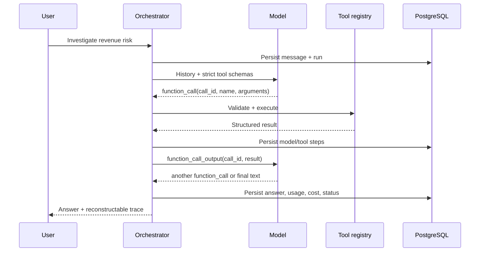

# Multi-step tool loop

The important invariant is that the model must see the tool result in the same evolving context that produced the call.

## Context handling

Within a run, the orchestrator preserves the provider's full output items, not only the function call name. It then appends a `function_call_output` item containing the same `call_id`. Across user turns, normalized user/assistant messages are loaded from PostgreSQL.

For very large conversations, a production implementation can combine durable normalized history with the provider's conversation object or `previous_response_id`. The manual representation here keeps the data boundary explicit and portable.

## Strict schemas

Every tool model uses `extra="forbid"`. Generated schemas set `additionalProperties: false`, and every declared property appears in `required`. Arguments are validated again before execution; a model-generated schema violation never reaches an integration handler.

## Loop safety

The orchestrator fingerprints `tool_name + canonical JSON arguments`. Repeating the same signature beyond the configured count marks the run guarded. A separate maximum model-step limit catches loops whose arguments change slightly, while the total deadline and estimated cost cap bound time and spend.
